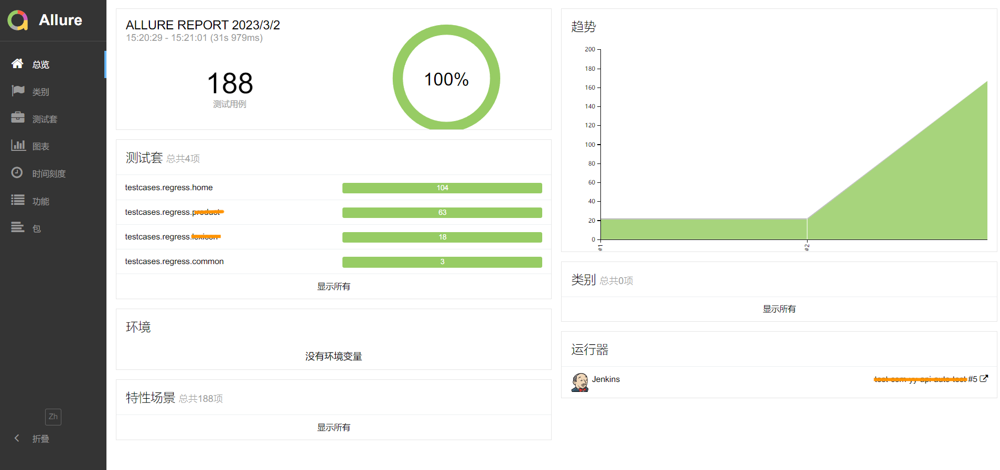

## 🚀功能说明
1. 以py|yaml文件作为测试用例管理，建议用py文件方便维护
2. 支持单接口测试用例,同时也支持多接口依赖的用例场景
3. 支持三种参数化方式:Parameters|CSV|debugtalk.py
4. 框架除了支持hrun命令外，也兼容pytest的命令及其他插件
5. 支持用例参数提取、前置后置hook函数调用
6. 支持将har文件转py|yaml的测试用例文件
7. 支持数据库增删改查操作
8. 支持执行后的结果通知到钉钉群消息
9. 支持debugtalk自定义动态运算方法调用


## 📚目录结构
```
├─common
│  │  baseapi.py    
│  │  configer.py
│  │  constant.py
│  │  context.py
│  │  conver.py
│  │  dingtalk.py
│  │  jenkins.py
│  │  log.py
│  │  login.py
│  └─ mysql.py
│  
├─conf
│      mysql.ini
│      token.yaml
│      vcode.yaml
├─data
├─har
│  └─login.har
├─logs
├─reports
│  ├─allure-report 
│  └─allure-results
│
├─testcases
│  ├─regress
│  │  └─xxx.py
│  └─smoke
│     └─xxx.py
│ 
├─ .env                              
├─ conftest.py
├─ debugtalk.py
├─ pytest.ini
├─ README.md
├─ requirements.txt
└─ run.py
```

## ✨命令行规则

| 命令格式                       | 描述                          |
|----------------------------|-----------------------------|
| har2case xxx.har           | 将har文件转为py用例文件              |
| har2case har_demo.har -2y  | 参数-2y：将har文件转为yml用例文件       |
| hrun xxx.py / hrun xxx.yml | 运行py/yaml脚本                 |
| pytest xxx.py              | 运行py脚本,兼容pytest的命令参数 -v -s等 |


## 🎉用例模板

- config: 用例的全局配置
  - baseurl
  - variables
  
- step: 执行的步骤
    - 请求地址
    - 请求方法
    - 请求头信息
    - 请求体
    - 提取参数
    - 断言


## 🎃执行测试用例
`"-v", "-s",f"-m {mark}", "./testcases", "--alluredir=./reports/allure-results", "--clean-alluredir"`
- `mark`: 只执行带有某种特定的标签的用例(冒烟，回归)
- `alluredir`: allure 报告数据输出地址
- `allure-results`: allure 报告数据结果地址
- `allure-report`: allure HTML报告地址

## 🎈allure生成测试报告
`allure generate ./reports/allure-results -o ./reports/allure-report  --clean`



## 🔔钉钉群通知


